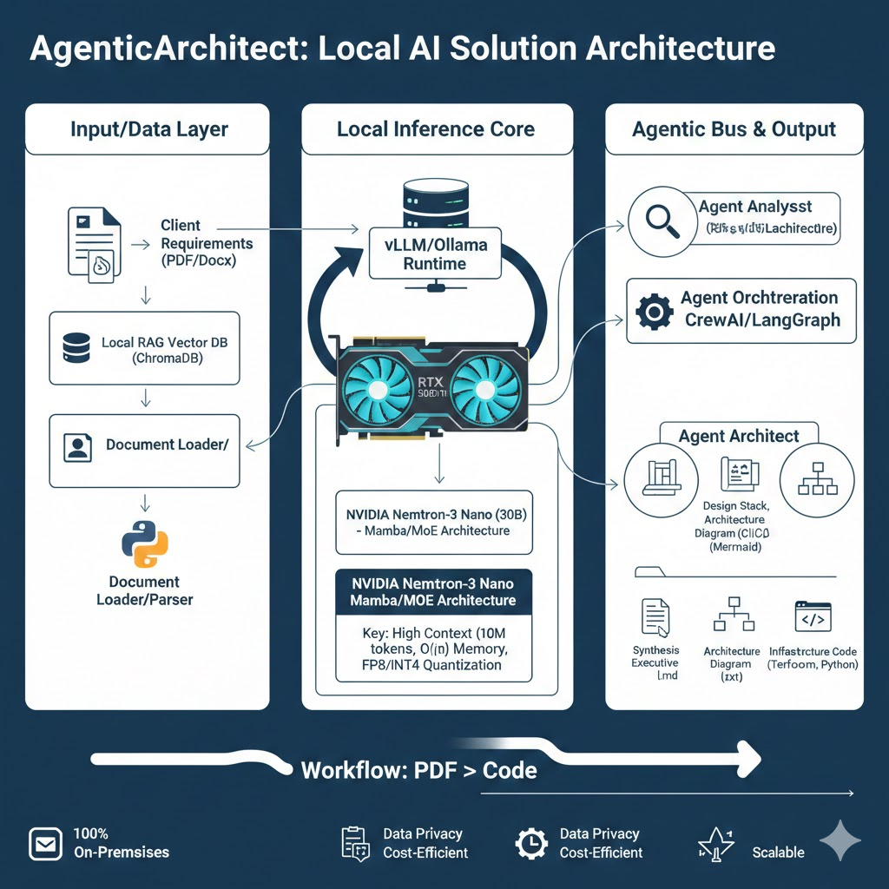

# User Guide

## Installation
1. Clone the repository

## Debugging
### 🪲 Quick K8s Debug Procedure

1. **Start Engine**: Run `skaffold debug` in your terminal. (that do port-forward and create debug port)
2. **Switch Namespace**: In the **Kubernetes Extension**, right-click `agentic-architect` > **Use Namespace**.
3. **Select Pod**: Go to **Workloads** > **Pods** > Right-click `architect-xxxx`.
4. **Attach**: Select **Debug (Python)** > Choose **Attach**.

